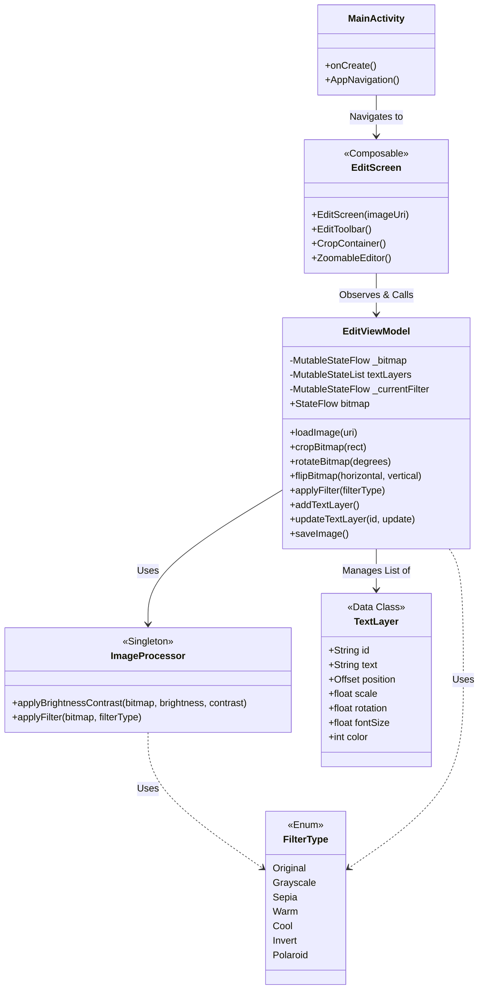
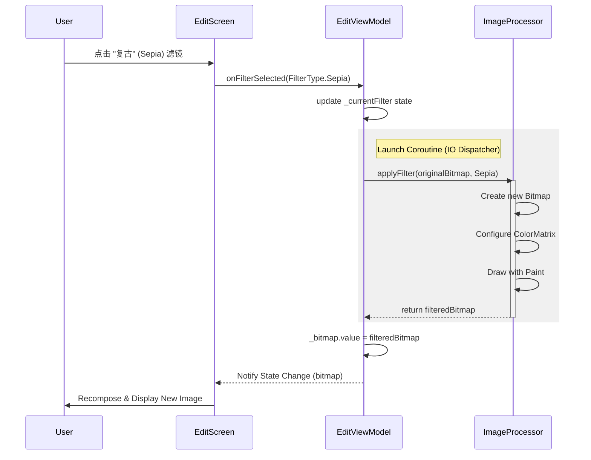
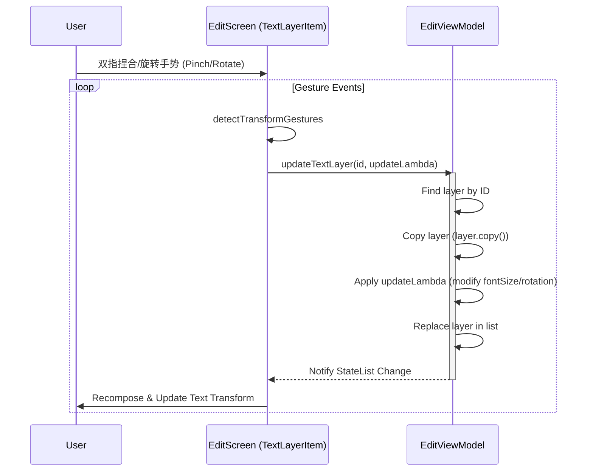

# 技术架构文档 (Technical Documentation)

## 1. 架构概览 (Architecture Overview)

本项目采用现代 Android 推荐的架构模式，基于 **MVVM (Model-View-ViewModel)** 设计模式，并使用 **Jetpack Compose** 作为 UI 框架。

*   **View (UI Layer)**: 由 Composable 函数组成（如 `EditScreen`, `MainScreen`），负责展示数据和响应用户交互。
*   **ViewModel (State Holder)**: `EditViewModel` 负责管理 UI 状态（如当前图片、滤镜状态、文字图层列表），处理业务逻辑，并与 Model 层交互。
*   **Model (Domain/Data Layer)**: 包含数据模型（如 `TextLayer`）和工具类（如 `ImageProcessor`），负责实际的数据处理和图像算法。

## 2. 核心模块类图 (Class Diagram)

以下类图展示了编辑模块的核心类及其关系。

### 关键类说明

1.  **`EditViewModel`**: 编辑器的核心控制器。它持有 `Bitmap` 的状态流 (`StateFlow`)，任何对图片的修改（裁剪、旋转、滤镜）都会更新这个状态，从而触发 UI 的重绘。它还管理着文字图层列表 `textLayers`。
2.  **`ImageProcessor`**: 单例工具类，封装了所有底层的图像处理算法。它接收一个 `Bitmap`，应用 `ColorMatrix` 或其他变换，并返回一个新的 `Bitmap`。
3.  **`TextLayer`**: 数据模型，描述了一个文字图层的所有属性（文本内容、位置、旋转角度、缩放比例、颜色等）。
4.  **`EditScreen`**: UI 层的入口。它根据 `EditViewModel` 的状态渲染界面，并将用户的点击事件（如点击“裁剪”按钮）转发给 ViewModel。

## 3. 核心功能时序图 (Sequence Diagram)

### 3.1 应用滤镜流程 (Applying a Filter)

此时序图展示了用户点击滤镜按钮后，系统内部的交互流程。

### 3.2 文字图层操作流程 (Manipulating Text Layer)

此时序图展示了用户双指缩放/旋转文字图层的流程。

## 4. 关键技术点 (Key Technical Points)

### 4.1 状态管理与重组 (State Management & Recomposition)
*   **Bitmap 状态**: 使用 `StateFlow<Bitmap?>` 管理当前编辑的图片。ViewModel 中的操作（如旋转）是异步的，完成后更新 StateFlow，Compose UI 自动响应变化。
*   **文字图层列表**: 使用 `mutableStateListOf<TextLayer>`。为了确保 Compose 能监听到列表项属性的变化（如位置移动），我们在更新时采用 **"Copy & Replace"** 策略，即创建一个修改后的新对象替换旧对象，强制触发列表的更新通知。

### 4.2 图像处理 (Image Processing)
*   **ColorMatrix**: 滤镜、亮度、对比度的调整均通过 Android 的 `ColorMatrix` 实现。这是一个 4x5 的矩阵，可以高效地对像素的 RGBA 分量进行线性变换。
*   **Bitmap 操作**: 所有的图像处理都在后台线程 (`Dispatchers.IO`) 进行，防止阻塞主线程导致 UI 卡顿。使用 `Bitmap.createBitmap` 和 `Canvas` 来生成处理后的新图片。

### 4.3 手势交互 (Gesture Interaction)
*   **Compose PointerInput**: 使用 `pointerInput` 修饰符处理触摸事件。
*   **多点触控**: 结合 `detectTransformGestures` 和 `detectDragGestures`（或自定义逻辑）来实现平移、缩放和旋转的同步处理。特别是在文字编辑中，我们将双指的缩放映射为 `fontSize` 的改变，旋转映射为 `rotation` 角度的变化。

